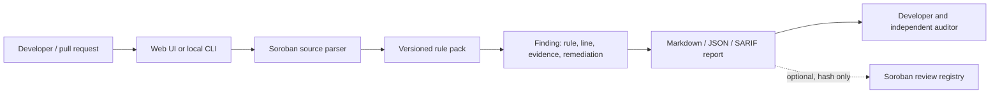

# SorobanShield technical architecture

## Problem

Soroban contracts use Rust and a model that differs materially from EVM contracts: authorization is explicit, storage has instance/persistent/temporary lifecycles, and contract calls use the Soroban host. Generic scanners often do not present those review points in a Soroban-native workflow.

## Solution

SorobanShield is local-first audit-preparation tooling. Its current browser MVP scans pasted Rust source with transparent deterministic rules and produces explainable findings. The funded roadmap adds tested rules, fixtures, a local CLI, and CI output. It does **not** claim to replace an independent audit.



## Current MVP

| Component | Status | Responsibility |
|---|---|---|
| Next.js scanner | Implemented | Local source entry, four heuristic rules, findings, Markdown export |
| Rule engine | Implemented | Authorization, persistent storage, cross-contract invocation, arithmetic review prompts |
| Report registry contract | Starter source included | Optional hash-only attestation; no source code or full report is stored on-chain |
| CLI / GitHub Action / AI review | Planned | Future 30-day sprint deliverables; not represented as complete |

## Smart-contract design

The scanner itself should remain off-chain: analysis requires source code and AST processing, which is unsuitable and unnecessarily expensive on-chain. The included Soroban contract is an opt-in **review registry**. It records a hash of a report and its reporter, enabling projects to prove a review artifact existed without publishing proprietary source or report contents.

Authorization is explicit: the submitting reporter must authorize each record, and the contract owner must authorize any metadata policy change. The contract avoids custody, transfers, token issuance, and automated security verdicts.

## API specification (planned local service / CLI)

`POST /v1/scan`

```json
{
  "source": "Soroban Rust source",
  "format": "json",
  "ruleset": "sorobanshield@0.1"
}
```

The response contains a scanner version, rule id, severity, location, evidence, explanation, remediation, and a limitation notice. Source is processed locally by default; any hosted mode must require explicit opt-in before retention or telemetry.

`POST /v1/reports`

Generates a Markdown, JSON, or SARIF report from an existing scan. A report hash may be submitted to the optional registry contract only after the user explicitly requests it.

## Security and privacy model

- Source remains in the browser in the current MVP.
- Findings are explainable and tied to a rule and source line.
- The product uses conservative wording: a finding is a review prompt, not a proven exploit.
- On-chain records contain only user-provided hashes and minimal metadata.
- Secrets, private repositories, and undisclosed vulnerability details must never be submitted to public issues or public chains.

See [THREAT_MODEL.md](THREAT_MODEL.md) for risks and controls.
